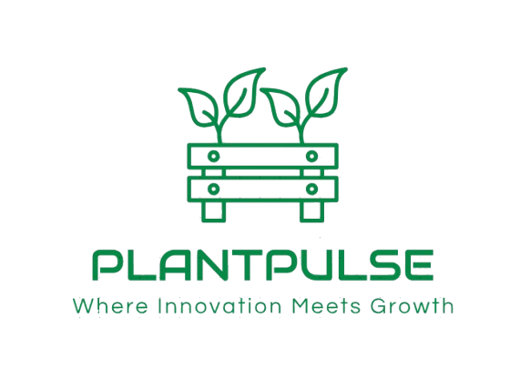
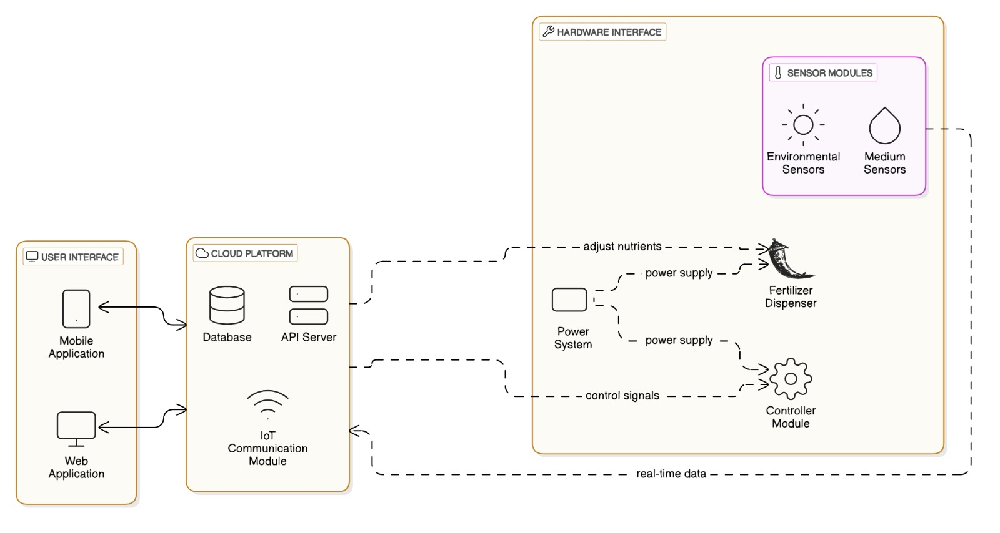
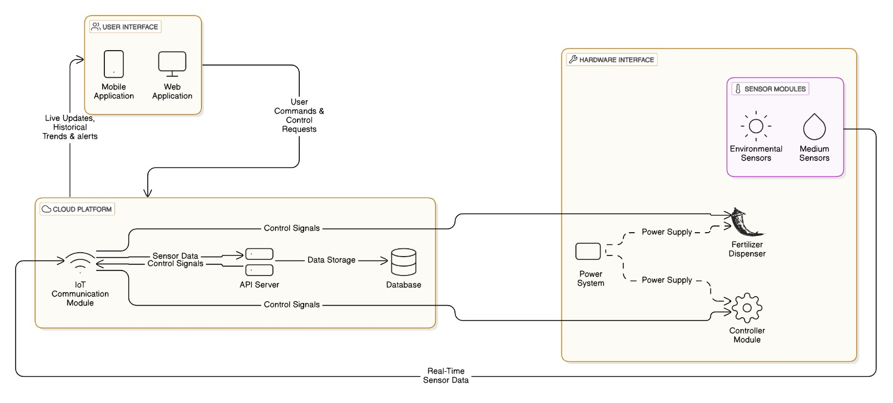

# Plant-Pulse

<!--  -->

---

## Team
-  E/20/133, Tharusha Haththella, [e20133@eng.pdn.ac.lk](mailto:e20133@eng.pdn.ac.lk)
-  E/20/305, Sachindu Premasiri, [e20305@eng.pdn.ac.lk](mailto:e20305@eng.pdn.ac.lk)
-  E/20/381, Nimesha Somathilaka, [e20381@eng.pdn.ac.lk](mailto:e20381@eng.pdn.ac.lk)
-  E/20/385, Devin Sriyarathna, [e20385@eng.pdn.ac.lk](mailto:e20385@eng.pdn.ac.lk)

<!-- Image (photo/drawing of the final hardware) should be here -->

<!-- This is a sample image, to show how to add images to your page. To learn more options, please refer [this](https://projects.ce.pdn.ac.lk/docs/faq/how-to-add-an-image/) -->

<!--  -->

## Introduction

Welcome to the future of farming! Our cutting-edge IoT-based system is designed to transform hydroponic farming into an efficient, sustainable, and user-friendly solution. By introducing smart sensor devices, we provide real-time monitoring and control like never before.

One sensor continuously analyzes the hydroponic medium, ensuring optimal conditions for plant growth, while another tracks key atmospheric parameters. Complementing these sensors is an automated fertilizer dispenser and a fluid circulation motor, maintaining a perfect balance for your crops.

With live updates and full control accessible through our mobile application, urban farmers and multidisciplinary researchers can now manage their farms with ease and precision. Our mission is to encourage urban communities to embrace farming and contribute to advancing research in sustainable agriculture.

## Solution Architecture

## Data Path

## Technologies Used

### Hardware Components

#### Microcontrollers \& Sensors

- **ESP32**: Primary microcontroller for data collection and wireless communication
- **pH Sensor (pH4502C)**: Monitors acidity/alkalinity levels of the hydroponic solution
- **Temperature \& Humidity Sensor (DHT22)**: Tracks atmospheric conditions
- **Turbidity Sensor (MD0591)**: Measures water clarity and nutrient concentration
- **Water Level Sensor (PSR-22-B2 V12767)**: Monitors fluid levels in the system
- **Light Intensity Sensor (GY-30)**: Measures ambient light conditions

#### Actuators \& Controls

- **Automated Fertilizer Dispenser**: Controlled nutrient delivery system
- **Fluid Circulation Motor**: Maintains proper water circulation
- **LiPo 2200mAh Batteries**: Portable power supply for remote operation

### Software Stack

#### Embedded Development

- **Arduino IDE**: Development environment for ESP32 firmware programming
- **C/C++**: Programming language for microcontroller logic
- **ESP32 Libraries**: WiFi, HTTP client, and sensor interface libraries

#### Backend \& Database

- **Firebase Realtime Database**: Cloud-based data storage and synchronization
- **Firebase Authentication**: User management and security
- **Firebase Cloud Functions**: Server-side logic and data processing
- **RESTful APIs**: Data communication protocols

#### Mobile Application

- **React Native**: Cross-platform mobile app development framework
- **JavaScript/TypeScript**: Primary development language
- **Firebase SDK**: Integration with backend services
- **React Navigation**: App navigation and routing
- **Native Device APIs**: Access to device sensors and notifications

#### Development Tools

- **Git**: Version control system
- **npm/yarn**: Package management
- **Visual Studio Code**: Code editor
- **Android Studio**: Android development and testing
- **Xcode**: iOS development and testing (for iOS builds)

## Installation \& Setup Instructions

### Prerequisites

- Node.js (v14 or higher)
- Arduino IDE (v1.8 or higher)
- Android Studio (for Android development)
- Git
- Firebase account

## Detailed budget

| Item                                | Quantity | Unit Cost (LKR) | Total (LKR) |  
|-------------------------------------|:--------:|:---------------:|------------:|  
| ESP32                               | 4        | 1500            | 6000        |  
| PH Sensor: pH4502C                  | 1        | 6000            | 6000        |  
| Temperature & Humidity Sensor: DHT22| 1        | 400             | 400         |  
| Turbidity Sensor: MD0591            | 1        | 2500            | 2500        |  
| Water Level Sensor: PSR-22-B2 V12767| 1        | 750             | 750         |  
| Light Intensity Sensor: GY-30       | 1        | 350             | 350         |  
| Sensor Mounting Structures          | 4        | 500             | 2000        |  
| Cabling and Connectors              | N/A      | 1000            | 1000        |  
| Power Supply: LiPo 2200mAh          | 2        | 1000            | 2000        |  
| Database and Cloud Platform         | 1 month  | 30/GB           | 3000        |  

## Links

- [Project Repository](https://github.com/cepdnaclk/e20-3yp-Monitoring-and-controlling-soilless-agricultural-plantations)
- [Project Page](https://sachindu01.github.io/PP/)
- [Department of Computer Engineering](http://www.ce.pdn.ac.lk/)
- [University of Peradeniya](https://eng.pdn.ac.lk/) 

